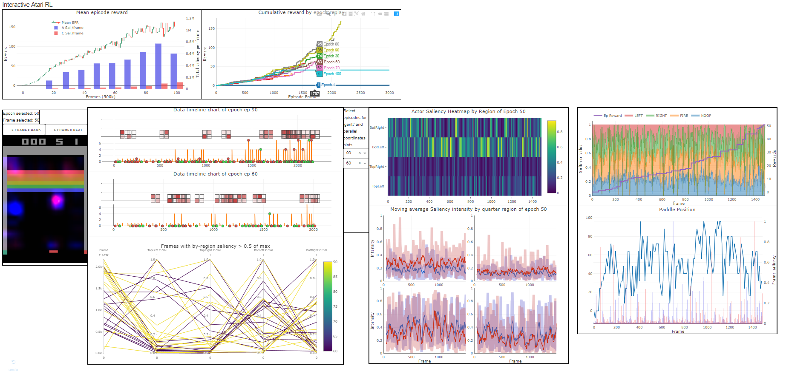

# Interactive Visual Reinforcement Learning on Atari's Breakout
#### A CS-8395 Project 

This project intends to address challenges with understanding complex reinforcement learning agents on complicated tasks like Atari games through visual aids. An A3C model is trained to play Breakout and the results are analyzed with an interactive dashboard built on Dash. 



## Baseline 
The baseline work for this project comes from Sam Greydanus' paper [*Visualizing and Understanding Atari Agents*](https://arxiv.org/abs/1711.00138). 

## Environment Install
- [Python 3.7](https://www.python.org/)
- [PyTorch 1.0.1](https://pytorch.org/)
- [Dash 0.41.0](https://dash.plot.ly/installation)
- [h5py 2.8.0](https://www.h5py.org/)
```
pip3 install https://download.pytorch.org/whl/cpu/torch-1.0.1.post2-cp37-cp37m-linux_x86_64.whl
pip3 install torchvision
// or if you're using conda
conda install pytorch-cpu torchvision-cpu -c pytorch

pip install dash==0.42.0  
pip install dash-daq==0.1.0
pip install h5py==2.8.0

pip install pandas
pip install matplotlib
pip install scipy
```

## Instructions:
### To run the dashboard:
Download the [Generated Data](https://drive.google.com/file/d/1V_J2HgOi3roHSsfagtqdQEC1cJK-Bnxv/view?usp=sharing) and place it into a folder called `static`. 
```
mkdir static
python app.py # localhost:8050
```

### __To train a new model:__
```
cd baby-a3c
python baby-a3c.py --load_model <model name> 

python baby-a3c.py --load_model <old model name> # to continue training on an older model
```

### __To generate data used for the dashboard:__
The dashboard operates off of two files: a training log file (csv) and an h5 file of generated data from rolling-out models saved at different epochs. This creates an h5 file in `static`. 

**Data captured consists of:**
- Environment state (image as np array)
- Hidden state of GRU cell 
- Logits 
- Values 
- output (probability over actions)
- Actor/Critic saliency 
```
cd visualize_atari
python generate_data.py
```

### __To play around with saliency maps and data:__
```
jupyter notebook
-> visualize_atari/jacobian-vs-perturbation.ipynb
```

# References/Source Material
Code adapted from Sam Greydanus' work:

https://github.com/greydanus/visualize_atari - generate saliency maps of agent playthroughs
https://github.com/greydanus/baby-a3c - for a3c model training 
https://arxiv.org/abs/1711.00138 

MIT License
